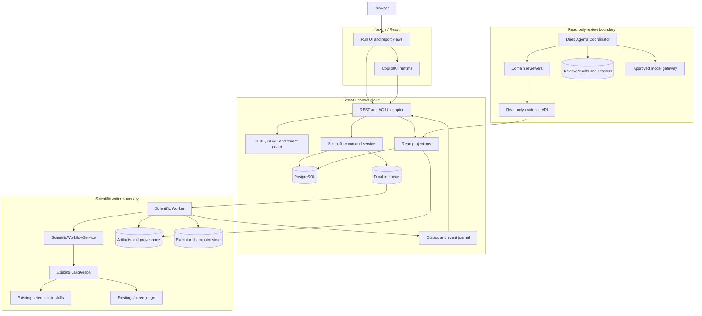

# CopilotKit product architecture

## Status and scope

This document began as a **Phase 0 product architecture** and is now part
implementation record. It records how a browser product surrounds the existing
scRNA-seq executor without becoming a second executor or a second source of
scientific truth.

| status | meaning in this document |
|---|---|
| **Current** | code and behaviour that exist on this branch today |
| **Near-term** | the next bounded implementation slices; not implemented |
| **Production target** | the full service architecture after the near-term slices have proved their contracts |

**What has since been built, and where its own documentation lives.** Several
things this document listed as absent now exist, and §2.5 and §3 have been
corrected accordingly:

| | status | authority |
|---|---|---|
| Next.js / React / CopilotKit UI | Current | `apps/web/README.md` |
| Read-only FastAPI gateway | Current | `services/gateway/README.md` |
| Write-capable analysis controller | Current, local MVP | `services/controller/README.md` |
| Scientific worker and durable job queue | Current, local MVP | `services/controller/README.md` |
| External (browser) human-gate mode | Current | `docs/analysis_request_contract.md` |
| `ScientificWorkflowService` | Current, as `src/service.py` — two functions, not a service class | `src/service.py` |
| AG-UI events or SSE replay | **absent** | polling is used instead, and is labelled as such |
| Queue, PostgreSQL, object storage, API authentication | **absent** | SQLite and no auth; see the controller README's limitations |
| Deep Agents runtime | **absent**; `deepagents` is not installed | `docs/deep_agents_architecture.md` |

Where this document and the code disagree, the code wins and this document is
wrong. `docs/analysis_request_contract.md` is the maintained record of the
write-side contract.

`docs/deep_agents_architecture.md` is the companion design for the read-only
review layer: reviewer responsibilities, evidence contracts, prompt shape and
evaluation. This document defines the surrounding product boundary. Where the
two documents describe the same boundary, these rules apply:

1. LangGraph is the only scientific workflow engine.
2. The Scientific Worker is the only writer of analysis artifacts, checkpoints,
   audit events, run metadata and reports.
3. Deep Agents are completely read-only. They may return cited findings and
   proposed overrides, but may not write a run, answer a gate, or execute a
   workflow operation.
4. `--resume-from` validates and reuses artifacts only.
5. `--continue-from` continues a suspended LangGraph checkpoint only.

The existing executor is the authority for all Current claims. In particular,
`src/run.py`, `src/persistence.py`, `src/graph.py`, `src/nodes.py`,
`src/registry.py`, `src/provenance.py` and `docs/report_contract.md` take
precedence over this future-facing design.

---

## 1. Invariants

### 1.1 One scientific executor

`src/graph.py::build_graph()` remains the only place that assembles scientific
routing, conditional edges, judges and human gates. API handlers, browser code,
CopilotKit agents and Deep Agents must not reproduce those branches or invoke
skills directly. `src/registry.py` remains the executable source of truth for
step order, judge labels, revisable parameters and invalidation.

A future product may wrap the executor in a `ScientificWorkflowService`; it may
not create a second workflow implementation.

### 1.2 One scientific writer

Only a run-scoped Scientific Worker may write under the scientific run storage
namespace:

```text
runs/<scientificRunId>/
  audit.jsonl
  run_metadata.json
  checkpoint.sqlite
  manifest/normalized.csv
  <step>/output.json
  <step>/adata.h5ad, tables, figures and report files
```

The worker owns step execution, artifact publication, checkpoint operation,
provenance, metadata changes and `build_report`. FastAPI, Next.js, CopilotKit
and Deep Agents get either command submission rights or read projections; none
gets the worker's write credentials.

### 1.3 Two resume mechanisms, deliberately separate

| operation | question | authority | required behaviour |
|---|---|---|---|
| artifact resume (`--resume-from`) | Which recorded work is still valid? | per-step output, artifact presence, audit log, metadata, input digest and config diff | start at `START`; call `plan_resume`; skip only verified work |
| checkpoint continuation (`--continue-from`) | Where did this graph suspend, and what question is pending? | run-scoped LangGraph checkpoint | open existing checkpoint; validate pending interrupt; submit one `Command(resume=...)` |

Artifact resume must not read a checkpoint to decide reuse. Checkpoint continuation
must not create fresh state, call `plan_resume`, or revalidate artifacts. A
missing, corrupt, mismatched or non-pending checkpoint fails loudly rather than
falling back to `START`.

These are Current executor semantics, documented in `src/persistence.py` and
`src/run.py`; the product inherits them unchanged.

### 1.4 Human decisions remain human decisions

A judge may score and advise. A Deep Agent may explain evidence or propose a
value. Neither can answer `accept`, `revise` or `stop`.

The only future web mutation is an authenticated human decision bound to the
exact pending gate, its version and its checkpoint generation. The server, not
the browser or an agent, records the operator identity. The current allowlist
and conversion path in `src/registry.py::coerce_overrides` remains the only
semantic validator of revisable values.

### 1.5 Three public identities, one internal checkpoint key

| identifier | scope | lifecycle | must not be confused with |
|---|---|---|---|
| `scientificRunId` | one scientific analysis and its provenance | stable across artifact resumes and checkpoint continuations | conversation and AG-UI execution IDs |
| `threadId` | one CopilotKit / AG-UI conversation | may discuss zero, one or many scientific runs | LangGraph checkpoint thread |
| `aguiRunId` | one AG-UI execution/turn | new for fresh execution, artifact resume, checkpoint continuation and each review turn | scientific run and conversation thread |
| `checkpointThreadKey` | LangGraph internal checkpoint lookup | Current value is exactly `scientificRunId` | public `threadId` and `aguiRunId` |

The compatibility invariant is explicit: the worker continues to call
`persistence.thread_config(scientificRunId, ...)`, so LangGraph's internal
`configurable.thread_id` remains the scientific run identity. A product-level
conversation thread never replaces it.

---

## 2. Current

### 2.1 Implemented scientific CLI and workflow

The current product surface is the CLI:

```bash
python -m src.run --input <FASTQ-or-matrix>
```

It supports FASTQ and count-matrix entry routes, raw/filtered branching,
per-library work, merge and Scanpy mainline. `src/graph.py` constructs the
LangGraph topology; `src/registry.py` defines 26 workflow steps; skills are
called directly as deterministic Python functions through `call_skill`.

The current graph has deterministic analysis nodes, one judge after each
meaningful step, an escalation human gate and a final run-level human gate.
`human_review_decision` is a gate rather than a judged scientific step. The
report is itself judged before a run can end.

### 2.2 Existing state, gates and checkpoint behaviour

`WorkflowState` contains the run identity, config, input and study-design
context, artifacts, metrics, step results, judge results, human decisions,
status, pending review and reusable-step flags. It is shared only among graph
nodes. Analysis nodes write outputs, judge nodes append verdicts, and gate nodes
append decisions.

Current terminal interaction is CLI-specific:

- `--interactive` creates `runs/<run_id>/checkpoint.sqlite` and calls
  `ask_on_terminal()`.
- `ask_on_terminal()` reads terminal stdin and identifies the local terminal
  operator.
- `--continue-from` opens that durable checkpoint and resumes its pending
  interrupt.

This is not the future web contract. A Web Worker must **never read terminal
stdin**, must never call `input()`, and must not depend on a terminal session to
answer a gate.

### 2.3 Existing artifact resume and checkpoint continuation

For `--resume-from`, `persistence.plan_resume()` verifies per-step output,
latest audit status, errors, recorded artifact paths, input digest and
config-dependent invalidation. It computes a safe cut and fails closed where it
cannot verify work. The graph starts from its beginning and only consumes
verified `resumed_steps` flags.

For `--continue-from`, `continue_workflow()` opens the stored SQLite checkpoint,
looks up the run's internal thread ID, verifies an actual pending interrupt,
audits `checkpoint_resumed`, and then issues `Command(resume=...)`. It does not
read `output.json` or plan artifact reuse.

### 2.4 Existing provenance, study design and report

Each run has append-only `audit.jsonl` and start-time `run_metadata.json`.
Metadata captures source commit/dirty state, package versions, resolved config,
input digest, seeds, de-identified study-design summary, judge sessions and
revisions. A revise decision updates both the recorded config and config digest,
so a later artifact resume cannot reuse results computed under superseded
settings.

The study-design contract keeps rows inside the run directory and exposes only
approved summaries, counts, columns and digests to metadata, audit and report.
The report has main-result, technical and audit tiers; it renders explicitly
unavailable evidence rather than recomputing or silently omitting it. The report
contract forbids new analysis during report construction.

### 2.5 Explicitly absent today

This list was written before the web slices existed and has been corrected.
What is **still** absent:

- AG-UI events or SSE replay. The intake page polls the controller and the
  worker polls the job table; neither streams, and nothing claims to.
- API authentication and authorization. Anyone who can reach the controller can
  confirm a request, which is why that service is labelled local-development
  and must not be exposed.
- Browser upload handling. Data reaches the pipeline by being placed inside an
  allowlisted root on the analysis machine, never by being uploaded.
- PostgreSQL, a real queue, and object storage. The controller uses one SQLite
  file and a polling worker.
- Multi-worker scheduling across machines.
- Deep Agents coordinator, reviewer, tools, review store and reviewer prompts.
  `deepagents` is not installed.
- Public FASTQ golden-run baseline and cleaned evidence fixture.

What has been built since, with the caveat that each is a bounded slice rather
than the production target described in §3:

- A `ScientificWorkflowService` — as `src/service.py`, two functions rather than
  a service class. `start_detached_run` starts a run that may stop and has
  nobody standing by; `continue_checkpoint_once` applies exactly one gate
  answer. Neither knows anything scientific.
- FastAPI endpoints, in two services: the GET-only gateway (§3.2) and the
  write-capable controller (`services/controller`).
- Next.js / React / CopilotKit UI (`apps/web`), including `/analysis/new`.
- An external human-gate mode: a browser can answer `accept`, `revise` or
  `stop` against a specific pending gate generation, validated by
  `coerce_overrides` and attributed to a server-resolved operator.
- A durable local job queue, in the same SQLite file as the controller's
  requests, with restart reconciliation that never re-queues a running job.

---

## 3. Near-term

Near-term work is deliberately ordered so that a web product observes proven
scientific work before it can control it.

**§3.1, §3.2 and §3.4 have since been implemented in bounded form**, and the
ordering held: the read-only projection (§3.2) and the observation UI (§3.4)
shipped and were used before anything could control a run. §3.3 (AG-UI) was
skipped rather than implemented — polling covers what the local MVP needs, and
claiming SSE without building it is the failure mode this document exists to
prevent. Each subsection below now carries its own status note.

What each section describes remains the *target*; what exists is a slice of it,
and the differences are stated in `services/controller/README.md` under
"Local-development limitations".

### Phase -1: public FASTQ golden-run baseline

Before Phase 0 product integration work, create a reproducible public FASTQ
golden run and a cleaned evidence fixture. This is Phase **-1** because the
product, API and reviewers need a known real FASTQ → count → downstream baseline
before they can be judged safely.

The baseline must include:

- a documented public input dataset and repeatable command;
- known reference/tool versions and expected route decisions;
- expected run status, key metrics and report sections;
- a de-identified fixture containing selected `output.json`, audit, metadata and
  report evidence, but no raw FASTQ, `.h5ad`, secrets, internal endpoint,
  hostname, absolute path or real operator identity;
- a file manifest with SHA-256 digests;
- regression checks that separate genuine output changes from fixture/redaction
  errors.

This establishes a scientific control before product work creates new runtime
surfaces. It is not a substitute for the existing test suite.

### Phase 0: architecture contracts

This document and `docs/deep_agents_architecture.md` record the Phase 0
boundaries. Before code is added, settle:

- identity mapping and checkpoint-generation lifecycle;
- API and event schema versions;
- artifact visibility, retention and sensitive-data classification;
- model-egress policy;
- exact package versions for any future CopilotKit/AG-UI/FastAPI/Deep Agents
  spike;
- whether a production checkpoint backend replaces run-local SQLite.

### 3.1 ScientificWorkflowService

**Status: partly Current, as `src/service.py`.** Two of the six operations
below exist, under the names this section gave them —
`continue_checkpoint_once` verbatim, and `start_new_run` as
`start_detached_run`, renamed because what distinguishes it is not that the run
is new but that nobody is standing by to answer its gates.

The other four were not built, and the reason is worth recording: they would
have been wrappers with no caller. `plan_artifact_resume` and
`start_artifact_resume` have no endpoint yet (re-requesting a finished run from
the browser is Near-term), and `get_run_projection` / `get_pending_gate` are
already answered without the executor — the gateway rebuilds a projection from
`audit.jsonl` and `run_metadata.json`, and the controller derives the pending
gate from the same log. Adding executor-side versions would have created a
second answer to each question.

So the seam is two functions rather than a class. What this section asked for —
wrapping existing core operations without changing their scientific semantics —
is met: neither function routes, decides what a value means, or knows what a
step does.

The full intended surface:

```text
start_new_run(...)
plan_artifact_resume(...)
start_artifact_resume(...)
continue_checkpoint_once(...)
get_run_projection(...)
get_pending_gate(...)
```

It may call existing `run_workflow`, `plan_resume`, `continue_workflow` and
registry/persistence helpers through one controlled worker path. It must not
rewrite graph topology, duplicate `argparse`, or accept arbitrary step/module
names.

`continue_checkpoint_once` is intentionally not the CLI's `_answer_until_done`
loop: one external human answer may resume exactly one interrupt. If the graph
opens another gate, the service records a new pending gate and stops; it never
reuses the prior answer.

### 3.2 Read-only FastAPI

**Status: Current, as `services/gateway`.** Implemented and unchanged by the
write-side slice: still GET-only, still never importing `src/`. The write
endpoints live in a *separate service* (`services/controller`) precisely so
this one's guarantee stays a property of its code rather than of a permission
check. See `services/gateway/README.md`.

The first API is observation-only. It presents redacted projections over
existing run directories and provenance; it does not start a run, resume a run,
answer a gate, run a skill or build a report.

Proposed read endpoints:

```text
GET /healthz
GET /readyz
GET /v1/workflow-definition
GET /v1/scientific-runs
GET /v1/scientific-runs/{scientificRunId}
GET /v1/scientific-runs/{scientificRunId}/steps
GET /v1/scientific-runs/{scientificRunId}/steps/{step}
GET /v1/scientific-runs/{scientificRunId}/artifacts
GET /v1/scientific-runs/{scientificRunId}/report
GET /v1/scientific-runs/{scientificRunId}/provenance
GET /v1/scientific-runs/{scientificRunId}/gates
```

The API receives opaque run and artifact IDs, never arbitrary host paths. It
returns a bounded UI projection, not raw `WorkflowState`, AnnData, manifest rows,
checkpoint contents or complete artifact dictionaries.

### 3.3 AG-UI observational layer

**Status: not implemented, and deliberately skipped for the local MVP.** The
intake page polls `/api/analysis-requests/{id}` and the worker polls its job
table. Polling is stated as polling in the UI, the controller README and
`docs/analysis_request_contract.md`; nothing in this repository claims SSE or
AG-UI streaming exists. Building it is worthwhile when there is a reason
beyond tidiness — a run whose steps a person watches live — and not before.

AG-UI is the real-time event protocol between the future frontend and the
backend. The initial adapter is observational: it maps a worker's recorded state
and audit events into ordered, replayable SSE events.

| Current event or state | proposed AG-UI representation |
|---|---|
| execution begins | `RUN_STARTED` |
| redacted run view | `STATE_SNAPSHOT` |
| status/current-step change | `STATE_DELTA` |
| `step_start` | `STEP_STARTED` |
| `step_end` / `step_skipped` | `STEP_FINISHED` plus `scrna.step.completed` |
| `judge` | `scrna.judge.completed` |
| `resume_plan` | `scrna.artifact_resume.planned` |
| `checkpoint_resumed` | `scrna.checkpoint.continued` |
| published artifact | `scrna.artifact.published` |
| terminal scientific outcome | `RUN_FINISHED` with scientific status in result |
| execution/protocol failure | `RUN_ERROR` |

The event journal is a product delivery log, separate from `audit.jsonl`.
`audit.jsonl` stays the scientific source of truth for what happened; the event
journal supplies sequence IDs, replay and reconnect without rewriting scientific
provenance.

### 3.4 CopilotKit UI

**Status: Current, as `apps/web`.** The read-only observation pages are
implemented, and so is `/analysis/new`, which is write-capable. The assistant
is split into two action sets that are never merged — five read-only actions
for explaining a run, four intake actions for preparing a request — and neither
set contains an action that can confirm a request or answer a gate.

Near-term UI is an observation product, not a control panel. It uses Next.js /
React and CopilotKit to render:

- run inventory;
- run overview and generated graph/timeline;
- step detail, metrics, judge verdict and known artifact links;
- report and provenance views;
- a pending-gate card with no action buttons at this stage;
- reconnect-safe streaming state.

Proposed routes:

```text
/runs
/runs/[scientificRunId]
/runs/[scientificRunId]/steps/[step]
/runs/[scientificRunId]/artifacts
/runs/[scientificRunId]/report
/runs/[scientificRunId]/provenance
```

Near-term components are `RunStatusHeader`, `WorkflowTimeline`, `StepResultCard`,
`JudgeVerdictCard`, `ArtifactBrowser`, `ReportSectionRenderer`,
`ProvenanceExplorer` and a read-only `PendingGateCard`. The production external
gate adds `GateEvidencePanel`, `RevisionOverrideForm`, `ActionEffectPreview` and
`DecisionConfirmationDialog`; those components submit only the explicit human
Decision API, never an assistant message or a local state patch.

Browser state is limited to presentation state: selected tab, table sort,
expanded graph nodes and unsent local filters. Scientific status, config, gate,
artifacts and provenance remain server-owned. The UI does not optimistically
change them.

---

## 4. Production target

### 4.1 Service topology



Only the Scientific Worker has write access to scientific storage. The reviewer
service has no writable mount of a run directory and no credentials for worker
commands.

### 4.1.1 Product records and ownership

| record | key fields | source of truth |
|---|---|---|
| `ScientificRun` | `scientificRunId`, project, status, current step, input set, active config revision, active checkpoint generation | scientific storage plus worker-owned provenance; PostgreSQL indexes it |
| `ConversationThread` | `threadId`, owner, session, retention policy | product database only |
| `AguiExecution` | `aguiRunId`, `threadId`, optional `scientificRunId`, kind, parent execution, event cursor | product event journal/database |
| `Checkpoint` | run, generation, `checkpointThreadKey`, backend location, workflow schema version, pending state | LangGraph checkpoint store only |
| `Gate` | `gateId`, run, checkpoint generation, step, revise target, allowed schema, version, pending-state hash | product control plane, reconciled against the live checkpoint |
| `GateDecision` | requested/effective decision, accepted/rejected overrides, authenticated actor, idempotency key, continuation execution | worker-written scientific audit after validation; product database tracks the command |
| `Artifact` | artifact ID, step/attempt, digest, size, media type, producer, sensitivity, retention | worker-owned artifact catalog/storage |
| `ReviewResult` | review ID, reviewer, evidence fingerprint, findings, citations, `applied: false` proposals | separate review store; never `runs/<id>/` |

`audit.jsonl` remains the scientific record of what occurred until an explicit,
tested migration establishes a replacement. The AG-UI event journal only records
transport delivery and replay; it does not replace provenance.

### 4.1.2 Production command flows

**New run:** browser submits approved asset IDs → FastAPI authorizes and records
a command → queue assigns one Scientific Worker → worker creates the run and
streams redacted events.

**Artifact resume:** an authorized user requests a plan → worker/service calls
`plan_resume` against the run evidence → the returned safe cut is displayed → a
separate confirmed command starts at `START` with only verified reusable steps.

**Checkpoint continuation:** the user reads one durable gate → submits one
versioned human decision → command service validates it and queues exactly one
continuation → worker opens the existing checkpoint and issues one
`Command(resume=...)`.

**Read-only review:** CopilotKit sends a question with selected run context →
Coordinator reads bounded evidence through the read API → reviewers return cited
findings → the review store publishes a stale-checked result. No review output
is sent to the worker as an instruction.

### 4.2 API families

All mutation endpoints require authenticated project scope, an idempotency key,
and a server-side concurrency check. There is deliberately no generic
`/resume`, `/invoke`, `/config`, `/rerun` or shell endpoint.

| purpose | proposed endpoint | semantics |
|---|---|---|
| input registration | `POST /v1/input-assets` | immutable, quarantined upload/input record |
| new scientific run | `POST /v1/scientific-runs` | queues a new worker execution; returns 202 |
| artifact-resume plan | `POST /v1/scientific-runs/{id}/artifact-resume-plan` | planning only; no graph invocation |
| artifact resume | `POST /v1/scientific-runs/{id}/artifact-resumes` | new execution from `START`; uses `plan_resume` only |
| inspect gate | `GET /v1/scientific-runs/{id}/gates/{gateId}` | immutable pending question and action schema |
| human decision | `POST /v1/scientific-runs/{id}/gates/{gateId}/decisions` | exact gate/version only; queues checkpoint continuation |
| execution replay | `GET /v1/executions/{aguiRunId}/events` | ordered SSE replay with `Last-Event-ID` |
| review | `POST /v1/scientific-runs/{id}/reviews` | read-only Deep Agents review |

The decision endpoint accepts exactly:

```json
{
  "decision": "accept | revise | stop",
  "rationale": "optional human rationale",
  "overrides": {}
}
```

It requires `If-Match` for the gate version. The server derives the operator
from authentication, verifies that the gate is the currently pending interrupt,
passes revise values through the existing allowlist/conversion path, and queues
one continuation command. An invalid value returns `422` while leaving the gate
open. A stale gate returns `409` or `412`; it never starts a new run.

### 4.3 AG-UI identities and replay

A workflow event projection contains only safe, bounded state:

```json
{
  "schemaVersion": 1,
  "conversation": {"threadId": "..."},
  "execution": {"aguiRunId": "...", "kind": "checkpoint_continue"},
  "scientificRun": {
    "scientificRunId": "...",
    "status": "needs_review",
    "currentStep": "apply_cell_qc_filter"
  },
  "pendingReview": {},
  "artifactDescriptors": [],
  "links": {}
}
```

It must not contain raw `WorkflowState`, absolute paths, raw manifest rows,
checkpoint data, secrets, full AnnData-derived objects or browser credentials.

Each persisted AG-UI event has an `eventId` and monotonic sequence. Reconnect
replays strictly after the supplied cursor, then joins the live stream without a
gap. A client applies snapshots by replacement and deltas in sequence; a gap or
patch failure requires a new snapshot, never a client-side guess.

### 4.4 External human-gate mode

The web contract is an **external human-gate mode**, not a repackaging of CLI
`interactive=True`.

| CLI today | production web target |
|---|---|
| `ask_on_terminal()` calls `input()` | worker never reads terminal stdin |
| local process owns operator identity | authenticated API derives operator identity |
| durable SQLite is resumed by CLI | command service validates durable gate and queues worker continuation |
| `_answer_until_done()` can keep asking its callback | one web decision resumes one interrupt only |

The future worker may use LangGraph's checkpoint and interrupt primitive, but
its gate adapter must emit a durable external question and then stop. It waits
for a validated API command; it never reads stdin, forwards an AG-UI message
straight into `Command(resume=...)`, or accepts an answer from an agent.

At an interrupt boundary the AG-UI adapter emits the redacted pending review,
`scrna.gate.opened`, a fresh state snapshot and, when the pinned protocol stack
supports it, a structured interrupted `RUN_FINISHED` outcome. Protocol support
must be feature-gated and contract-tested. If a frontend interrupt helper is
unavailable, the UI renders the same pending gate from the read API; it does not
invent a default answer.

### 4.5 Deep Agents Coordinator and reviewers

The product has two agent-facing surfaces:

| agent | role | write authority |
|---|---|---|
| `scrna-workflow` | non-LLM deterministic workflow observation adapter | none; it streams worker state but cannot submit a decision or command |
| `scrna-review` | Deep Agents Coordinator plus reviewers | none in scientific storage or workflow control |

The Coordinator scopes every question to authorized run IDs, creates an evidence
snapshot, delegates only relevant read-only reviewers, reconciles disagreement
without silently choosing a winner, checks citation coverage and publishes a
`ReviewResult` to the separate review store.

Initial reviewers can follow `docs/deep_agents_architecture.md`:

- Workflow / status;
- Gate safety;
- Primary processing and QC;
- Study design and integration;
- Annotation;
- Report / artifact;
- Provenance;
- Citation validation.

A reviewer may inspect only typed, bounded tools such as `get_run_snapshot`,
`get_pending_review`, `get_step_record`, `query_audit`, `get_report_section`,
`get_provenance`, `list_artifacts`, `read_table_slice` and `resolve_citation`.
It has no shell, arbitrary filesystem, raw database, generic HTTP, checkpoint,
workflow-skill or mutation tool.

Every run-specific claim needs an evidence reference that resolves to a known
step output field, audit event, metadata field or report section. Review results
include an evidence fingerprint and become stale if the run changes before they
are shown. A proposed override is always marked `applied: false`.

### 4.6 Storage and data ownership

The production control plane stores tenants, projects, roles, conversation
threads, AG-UI executions, idempotency records, worker leases, gate records and
review metadata in PostgreSQL. The worker stores scientific artifacts in
immutable object storage or a safely isolated run workspace, indexed by an
artifact catalog with digest, size, producer and sensitivity metadata.

Until a migration proves parity, the existing run directory remains canonical
for artifact reuse and `audit.jsonl` remains canonical for scientific events.
PostgreSQL indexes are projections, not a second writable provenance authority.
A future object-storage migration must preserve the per-step output, audit,
metadata and artifact-presence guarantees that `plan_resume` relies on.

Checkpoint storage is separate from CopilotKit conversation persistence. The
current per-run SQLite saver is valid for a pinned worker/local deployment;
horizontal production requires either worker/PVC affinity with a strict
single-writer lease or a supported transactional checkpoint backend. Whatever
backend is selected, its internal key remains `scientificRunId`.

### 4.7 Security and permission boundaries

- Authenticate browser/API traffic with OIDC, MFA where policy requires it, and
  project-scoped RBAC.
- Scope every run, artifact, gate, thread, execution and review by tenant and
  project. Return `404` rather than disclose another tenant's resource.
- Separate permissions for `artifact:resume`, `checkpoint:continue` and
  `gate:resolve`.
- Use compare-and-swap gate versions, idempotency records and one mutating worker
  lease per scientific run.
- Make API callers provide asset IDs, never filesystem paths. Canonicalize local
  worker paths; reject traversal, symlink escape, devices and unchecked archives.
- Quarantine uploads, verify size/digest/signature, cap decompression and parser
  resources, and validate manifests through the existing deterministic parser.
- Treat matrices, pseudonymous study-design mappings and small cohorts as
  restricted research data. Manifest validation is not a de-identification claim.
- Encrypt storage and backups; use a secrets manager and distinct service
  identities. Credentials, endpoint secrets and tokens never enter report,
  metadata projection, AG-UI stream, prompt or citation.
- Default model egress to deny. The review service receives only approved,
  redacted evidence through an approved model gateway.
- Do not register human decision, resume, artifact-write or shell endpoints as
  model-visible tools. Deep Agents cannot obtain those credentials.

### 4.8 Proposed repository layout

This is a target layout, not a created tree:

```text
apps/web/                       Next.js, React and CopilotKit UI
services/gateway/               FastAPI REST, AG-UI and read projections
services/worker/                ScientificWorkflowService and worker adapters
services/reviewer/              Deep Agents Coordinator, reviewers and read tools
packages/contracts/             OpenAPI, AG-UI, event and review schemas
infra/                          migrations, deployment, policies and observability
src/                            existing scientific LangGraph core
skills/                         existing deterministic scientific skills
```

The scientific Python environment remains isolated from future web and reviewer
service environments. Adding a web or model package must not silently alter the
pinned Scanpy/Cell Ranger analysis environment.

---

## 5. Phased implementation and exit criteria

| phase | produces | required exit criteria |
|---|---|---|
| **-1 public FASTQ baseline** | public FASTQ golden run and cleaned evidence fixture | repeatable documented run; expected outputs; redaction/digest checks; existing tests stay green |
| **0 architecture** | this document, Deep Agents architecture alignment, ADRs and threat model | identities, two-resume rule, worker-only writer rule and external gate mode accepted |
| **1 core façade** | `ScientificWorkflowService`, command types, lease/idempotency design and artifact manifest plan | existing graph/resume/provenance tests remain green; artifact resume never calls checkpoint continuation and vice versa |
| **2 read-only product** | FastAPI read API, projections, event journal, AG-UI observational adapter and CopilotKit run UI | no mutation endpoint; replay/state-projection/security tests pass; UI state agrees with canonical run evidence |
| **3 asynchronous execution** | queued scientific worker, upload quarantine, isolated workspaces and artifact publication | duplicate requests and worker failures create no duplicate scientific write; golden outputs match CLI baseline |
| **4 external web gate** | durable gate resource, authenticated decision API and single-answer checkpoint continuation | two-tab/stale/idempotency/race tests prove one gate close only; no stdin; report provenance records actual human |
| **5 Deep Agents review** | read-only Coordinator, initial reviewers, citations, stale detection and evaluation | zero unauthorised modifications; all citations resolve; false-alarm/detection measurement beats or matches controls |
| **6 production scale** | PostgreSQL/RBAC, object storage, production checkpoint backend or affinity, retention and recovery | restore/fault-injection tests pass; no checkpoint/thread namespace collision; no data-egress violation |

No phase is a licence to alter the scientific graph without its own scientific
change, tests and evidence.

---

## 6. Not implemented

At the time this document was written, all Near-term and Production target
components remain designs only. In particular, no package was installed, no
service or frontend was created, no endpoint exists, no worker queue runs, no
agent can inspect a run, and no web client can answer a human gate.

The Current CLI remains the only supported execution interface.

---

## 7. References

- `docs/deep_agents_architecture.md` — reviewer-specific architecture,
  evidence contract and evaluation plan.
- `prompts/agents/README.md` — required future reviewer-prompt shape.
- `src/run.py` — CLI entry, artifact resume, checkpoint continuation and terminal
  interaction.
- `src/graph.py`, `src/nodes.py`, `src/state.py`, `src/registry.py` — graph,
  state, gate and revision contracts.
- `src/persistence.py`, `src/provenance.py` — persistence and provenance
  contracts.
- `docs/report_contract.md` and `docs/study_design.md` — reporting, privacy and
  study-design boundaries.
- <https://docs.copilotkit.ai/langgraph-python/backend/ag-ui>
- <https://docs.copilotkit.ai/deepagents>
- <https://docs.ag-ui.com/concepts/events>
