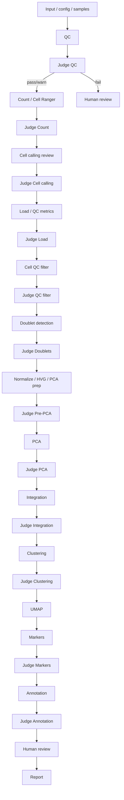

# LangGraph scRNA-seq Workflow Design

## 1. Design goal

將 single-cell RNA-seq 的核心分析流程做成 deterministic pipeline，並在每個關鍵步驟後接一個 local judge node。Judge 只回傳結構化評分與建議，不直接改寫分析結果。

## 2. Boundary

This repository only.

- ✅ 會在 `dcode_agentic_scrnaseq/` 內建立與修改
- ❌ 不修改 `claude_agentic_scrna/`

## 3. Recommended orchestration shape

Use **LangGraph** as the workflow/state-machine layer, with LangChain used for:

- local Ollama model wrapper
- prompt templates
- structured output parsing
- conversation memory if needed

Why LangGraph:

- fixed graph with conditional transitions
- easy checkpoint / resume
- explicit node boundaries
- suitable for “analyze -> judge -> human gate -> next step”

## 4. High-level graph



## 5. Node responsibilities

### Deterministic nodes

- `fastq_preflight`: structural checks — naming, R1/R2 pairing, read lengths, reference readiness
- `fastq_qc`: FastQC / MultiQC sequencing quality, judged on R2 because R1/I1 are barcodes
- `Count`: Cell Ranger count or equivalent
- `Cell calling`: decide which barcodes are cells
- `Load`: import matrices into AnnData
- `Cell QC filter`: apply filtering thresholds
- `Doublets`: detect and annotate doublets
- `Normalize / HVG / PCA prep`: standard preprocessing
- `PCA`: dimensionality reduction
- `Integration`: batch correction / latent embedding
- `Clustering`: Leiden or similar
- `UMAP`: visualization
- `Markers`: differential expression for cluster markers
- `Annotation`: label clusters
- `Report`: final HTML/PDF export

### Judge nodes

Each judge node receives:

- step name
- input summary
- key metrics
- output artifacts
- previous decision context

and returns:

- `verdict`: `pass | warn | fail`
- `score`: numeric, e.g. 0–100
- `reasons`: array of strings
- `evidence`: cited metrics
- `suggested_action`: optional text
- `needs_human_review`: boolean

## 6. Suggested judge schema

```json
{
  "step": "step5_qc_filter",
  "verdict": "warn",
  "score": 72,
  "reasons": [
    "mitochondrial fraction cutoff removes 18% of cells",
    "cluster 7 is enriched for low-UMI cells"
  ],
  "evidence": {
    "cells_before": 12034,
    "cells_after": 9831,
    "removed_fraction": 0.183,
    "median_mito_before": 0.062
  },
  "suggested_action": "Inspect whether the filtered cluster is biological or low-quality",
  "needs_human_review": true
}
```

## 7. State object

The graph state should minimally track:

- `project`
- `config`
- `sample_metadata`
- `artifacts`
- `metrics`
- `judge_results`
- `human_decisions`
- `current_step`
- `run_id`
- `audit_log_path`

## 8. Human gate policy

- `pass`: continue automatically
- `warn`: continue only if policy allows, but record warning
- `fail`: stop and require human confirmation or parameter revision

## 9. Local model policy

Use a local model via Ollama / OpenAI-compatible endpoint.

The model should:

- see only step-relevant metrics
- return structured JSON only
- never execute shell commands
- never modify outputs directly

## 10. Next implementation slice

1. Create Python package skeleton under `src/`
2. Define state / judge schemas
3. Implement one deterministic step wrapper
4. Implement one judge node
5. Add a tiny LangGraph proof of concept
