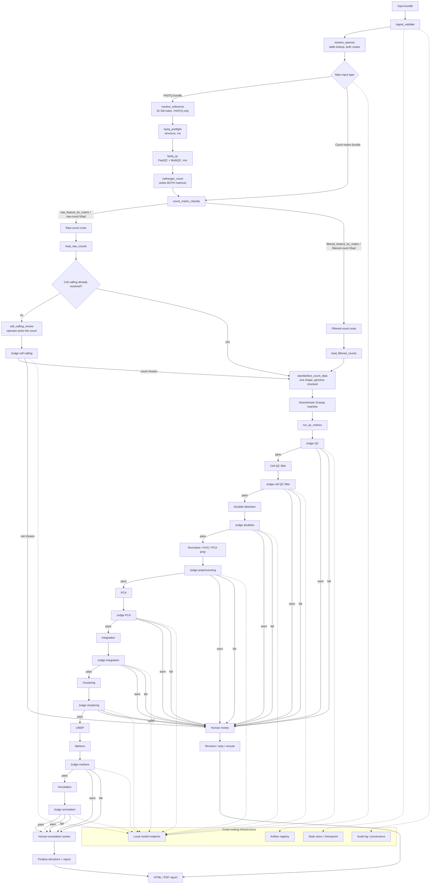

# FastQ + Count matrix main graph

這版只保留兩個主入口：

- **FASTQ**
- **Count matrix**

Count matrix 再拆成：

- **raw matrix**：可能還沒做 cell calling
- **filtered matrix**：通常已經做過 cell calling

## 這版的意思

- **`resolve_species` 在分岔前，`resolve_reference` 在 FASTQ 分支上。**
  物種常數（粒線體前綴、紅血球基因、marker 資料庫）兩條路都要，是查表；
  32 GB 的 transcriptome 只有 FASTQ 路線要。混在一起會讓矩陣路線經過一個
  它根本用不到的 reference 節點。
- **Cell Ranger 同時產生 raw 和 filtered**，所以 `cellranger_count` 是**選擇**
  用哪一份往下走（要自訂細胞數就走 raw），不是讓下游去猜。使用者直接給矩陣時
  才是真的要分類。`count_matrix_classify` 兩種情況都會驗證檔案內容符合宣稱。
- **`standardize_count_data` 是匯流點。** 三個 step 都可能產出矩陣，
  所以由一個節點保證下游拿到的形狀一致，並在這裡把 genome 跟宣告的物種對照
  —— 這是矩陣路線原本沒地方做的檢查。
- **主入口只有 FASTQ 和 Count matrix。**
- Count matrix 不再和 h5ad / latent data 混在一起。
- raw matrix 會先看 cell calling 是否已經解決；沒有的話就進 cell calling review。
- filtered matrix 直接進 downstream Scanpy 主線。
- 每個重要 step 後面都有 local judge；`warn` / `fail` 會把流程拉回 human review。

## 為什麼這樣最適合 MVP

1. 你現在的主要資料型態就是 **FASTQ** 與 **Count matrix**。
2. Count matrix 的真實差異不是檔名，而是 **raw vs filtered**。
3. 這樣可以先把 workflow 做穩，不需要一開始就支援所有 h5ad / latent 路徑。
4. 後面要擴充成 integrated h5ad / X_scvi 時，可以再加一條 side route，不影響主線。

## 對應 ClawBio

- `nfcore-scrnaseq-wrapper`：FASTQ → count matrix / preferred_h5ad
- `scrna-orchestrator`：count matrix → QC, clustering, markers, annotation
